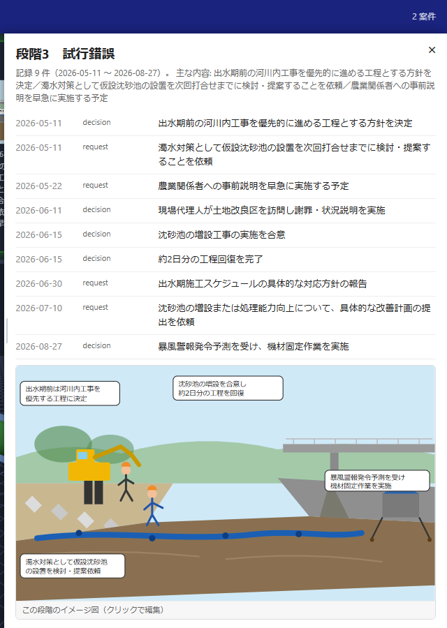
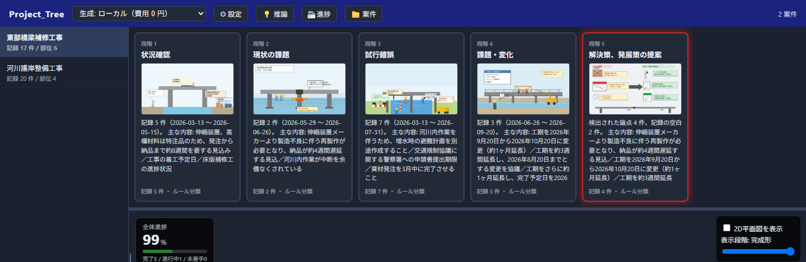
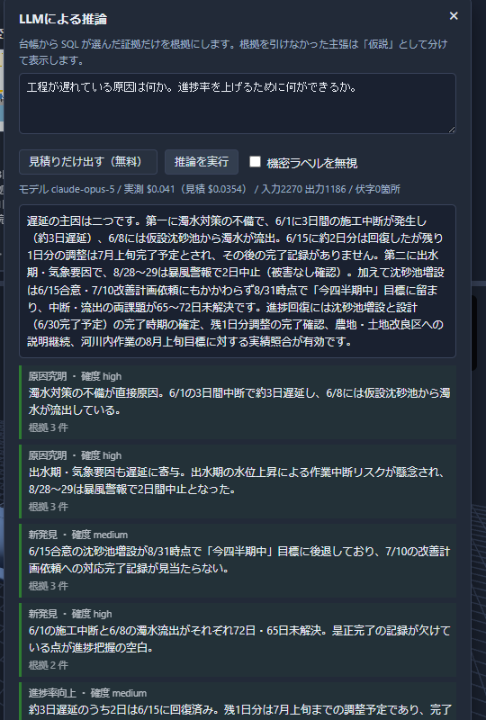

<!-- _paginate: false -->

# Project_Tree

## プロジェクトの過去・現在・次の一手を、1つの画面でつなぐ

議事録・メール・資料・画像・3Dモデルを、根拠のあるロードマップへ

<!--
発表者ノート：
Project_Treeは、散在するプロジェクト情報を時系列と5段階のストーリーに整理し、
資料用画像や2D・3Dモデルまで結び付けるアプリです。
-->

---

## 1. LLMの課題は「賢さ」だけでは解決しない

プロジェクト資料を毎回LLMへ渡し、その都度回答を作らせる運用には3つの課題があります。

- **揺れる**：同じ質問でも、回答や整理の仕方が変わる
- **誤る**：もっともらしい説明と、原文にある事実を見分けにくい
- **積み上がらない**：毎回読み直すため、時間と利用コストが繰り返し発生する

さらに、議事録・メール・報告書・画像・モデルが別々に保管され、判断の経緯が見えなくなります。

> 必要なのは、回答を作るだけのLLMではなく、根拠を残して再利用できる「プロジェクトの記憶」です。

<!--
推奨ビジュアル：散在する資料がLLMへ集まり、回答が毎回変化するイメージ。
（このスライドに対応する実画面のスクリーンショットは無いため、画像は未設置）
-->

---

## 2. 一度整理し、以後は根拠とともに参照する

そこで、業務情報を一度だけ構造化して台帳へ保存し、必要なときは保存済みの情報を参照する方針を採用しました。

### 開発で実現したかったこと

- プロジェクトが**なぜ始まり、どう進み、何が課題か**を時系列で理解する
- LLMの推論と、原文に基づく事実を分けて扱う
- 同じ情報を会議資料・プレゼン・進捗説明へ繰り返し活用する
- 文章だけでなく、資料用画像や2D・3Dモデルでも状況を伝える

**業務確定台帳の「根拠が残る時系列」と、3D進捗管理の「直感的な可視化」を統合したのがProject_Treeです。**

*実画面：時系列の記録を選ぶと、その段階のイメージ図（LLM生成）が記録の空欄に自動表示される*

<!--
発表者ノート：
LLMを完全に信用するのではなく、ルールで確定できる処理と、LLMに任せる推論を分けています。
-->

---

## 3. 入力から資料化までを、1本の流れにする

### 入力 → 整理 → 理解 → 可視化 → 出力

1. **入力**：プロンプト、フォルダ、文書、画像、2D・3Dモデルを取り込む
2. **整理**：記録を時系列化し、プロジェクトの5段階へ分類する
3. **理解**：課題、変化、記録の空白、食い違い、次の打ち手を確認する
4. **可視化**：資料用画像、2D図面、3Dモデル、部材・全体進捗を連動させる
5. **出力**：同じ情報から会議資料やプレゼン資料を作成する

**状況確認 → 現状の課題 → 試行錯誤 → 課題・変化 → 解決策・発展策**

*実画面：1案件の記録から自動生成された5段階のイメージ図（東部橋梁補修工事）*

<!--
推奨ビジュアル：5つの工程を左から右へ並べたシンプルなフロー。
-->

---

## 4. Project_Treeでできること

| 利用場面 | 主な機能 |
|---|---|
| 案件を始める | フォルダ名から案件を作成し、資料とモデルを一括で取り込む |
| 経緯をつかむ | 記録を5段階のストーリーと時系列に整理する |
| 判断を支える | 根拠となる記録を使い、原因・発見・改善案を推論する |
| 進捗を伝える | 資料用画像、2D図面、3Dモデル、部材進捗を連動表示する |
| 説明資料を作る | MD、PDF、Word、PowerPoint、Excelへ再構成して出力する |
| モデルを作る・使う | プリセットや写真からその場で2D/3Dモデルを生成し、GLB・STL・DXF・SVGなどの取り込み・出力にも対応 |

画面上の資料用画像やモデルを選ぶと、関連する段階・記録・原文へ移動できます。

*実画面：3D進捗管理パネル。①基本構造の追加 ②写真から作成 ③図面・モデル取込 は
いずれもアプリ内で完結し、Blenderは無くても動作する。画面下部の「Blender連携」は
接続できれば使える任意のオプションで、常時は「未確認」表示のまま。*

<!--
技術メモ（発表者向け）：
2D/3Dモデルの生成は trimesh（3D形状）と ezdxf（DXF）のみで完結しており、
Blenderへの依存は無い。Blenderが使われるのは「台帳の寸法をBlender側にも
組み立てさせ、そこで編集したものをGLBで受け取る」という追加の往復経路のみ。
Blenderアドオンが起動していなくても、通常のモデル生成・表示・出力は影響を受けない。

発表者ノート：
一番の特徴は、台帳、資料用画像、モデル、進捗が別々の機能ではなく、同じ案件情報でつながる点です。
-->

---

## 5. 導入効果は「探す・確かめる・作り直す」を減らすこと

| 導入前 | Project_Tree導入後に期待できる状態 |
|---|---|
| 複数フォルダから経緯を探す | 案件単位の時系列から経緯を確認できる |
| LLMの回答を原文と照合し直す | 根拠の記録・引用へすぐ戻れる |
| 会議ごとに資料を作り直す | 同じ整理結果を複数形式へ再利用できる |
| 文章だけで進捗を説明する | 画像・2D・3Dと進捗率で直感的に共有できる |
| 処理後にAI利用額が分かる | 実行前の原価見積りとモデル選択ができる |

### 期待する成果

**説明準備の短縮／認識違いの早期発見／引き継ぎ品質の向上／LLM利用コストの管理**

*実画面：LLMによる推論結果。実測 $0.041（claude-opus-5）、入力2,270→出力1,186トークン、
根拠を引けなかった主張（捏造ID）は0件。原価と検証結果を常に画面へ出す。*

※定量効果は、実案件でのPoCを通じて測定します。

---

## 6. 課題は実在し、対価を払う相手がいる

### 課題の実在性　― 一次情報で語られているか

- 工期・仕様変更の伝達漏れ、原文と食い違う記録は、実際の建設現場で日常的に起きている
- 検証データも、実案件の議事録・メール・発注書を模した一次情報から作成
- 推論の根拠は必ず実データの `event_id` を引用し、引用できない主張は「仮説」に分離（捏造ゼロを実測）

### ビジネス成立性　― 誰が、何に、いくら払うか

| | |
|---|---|
| 支払う人 | 建設・土木の現場管理部門／工事事務所（元請・監理） |
| 支払う理由 | 説明資料の作成時間、認識違いによる手戻り、引き継ぎ時の経緯調査コストの削減 |
| 価格の型 | 案件単位ライセンス＋従量のAI利用実費（実行前見積り→承認の運用で予算超過を防止） |
| 比較対象 | 資料作成を外注・残業で賄う人件費、食い違いに気づけず生じる手戻りコスト |

---

## 7. AIでなければ作れない、根拠つきの体験

### AIである必然性

議事録・メールの自然文から時系列と因果を読む作業はルールベースでは網羅できない。状況を要約するだけでなく漫画絵風の図解を状況ごとに描き分ける創造的処理、「事実／仮説」の分離は、LLMの生成力と検証ロジックの両方があって初めて成立する。

### 技術的な作り込み

ルール判定はSQL、推論だけLLMを呼ぶ2レーン構成で幻覚の混入範囲を最小化。処理内容ごとにHaiku/Sonnet/Opusを自動選択し、Orca Routerへも切替可能。内容ハッシュのdoc_idで再現性を確保し、異常系36ケースで未処理例外0件を実測。2D/3Dモデル生成はtrimesh・ezdxfのみで完結し外部ツール非依存、Blenderは任意の追加連携として分離。

### 次世代性・独創性

「その場で答えるAI」ではなく、根拠を貯めて資産化する台帳型LLM活用。SVGで生成し要素ごとに編集・アニメ化できるAIイラストは類例が少ない。台帳・イラスト・3Dモデルが同じ記録IDでつながる、記録駆動のデジタルツイン。

---

## 8. 次は「使える試作品」から「任せられる業務基盤」へ

### 短期：精度と安全性を実案件で検証する

- 実データで、時系列・段階分類・モデル部位との関連付け精度を評価する
- Outlookメール、既存Excel、BIM／IFCなど、現場で使う形式への対応を広げる
- 認証、権限管理、監査ログ、保存データの暗号化を強化する

### 中期：人の確認を組み込んで継続運用する

- 推論結果の承認・修正・差し戻しを履歴として残す
- 新しい資料だけを差分処理し、ロードマップと進捗を自動更新する
- 作業内容に応じたモデル選択で、品質とコストを最適化する

### 長期：プロジェクトの知識を次の判断へ生かす

- 複数案件の知見を横断し、遅延・コスト・安全上の兆候を早期に示す
- 記録、資料、モデル、意思決定がつながる「プロジェクト・デジタルツイン」へ発展させる

---

<!-- _paginate: false -->

## Project_Treeが変えるのは、LLMの使い方です

# その場で答えを作るAIから、
# 根拠と経緯を育てるプロジェクト基盤へ。

まずは1案件でPoCを行い、資料作成時間・修正件数・利用コスト・分類精度を測定します。

<!--
発表者ノート：
「何でも自動化するアプリ」ではなく、事実と推論をつなぎ、説明可能な形で再利用する基盤として締めます。

作成根拠（非表示）：
- README.md：業務確定台帳の設計原則、現状、既知の制限
- reference.md：データフロー、API、コスト設計、既知の制限
- Enhancement.md / Enhancement02.md / proposal.md：Project_Treeの目的と改善要件
- server.py / projecttree/*.py / static/projecttree.html：実装済み機能と入出力形式
- projecttree/modelgen.py：2D/3Dモデル生成は trimesh・ezdxf のみに依存し Blender 非依存であることを実装から確認
-->
