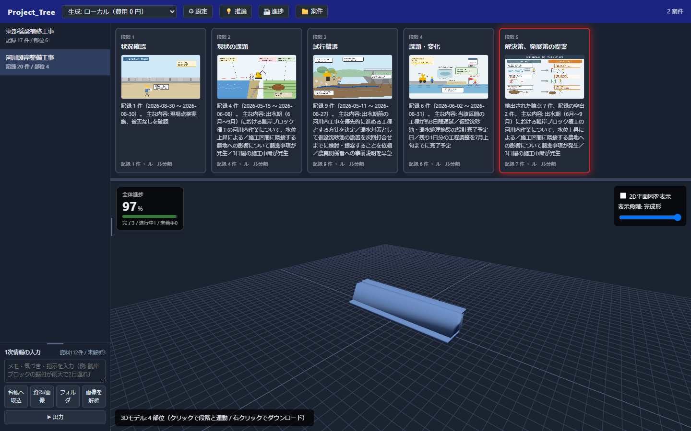
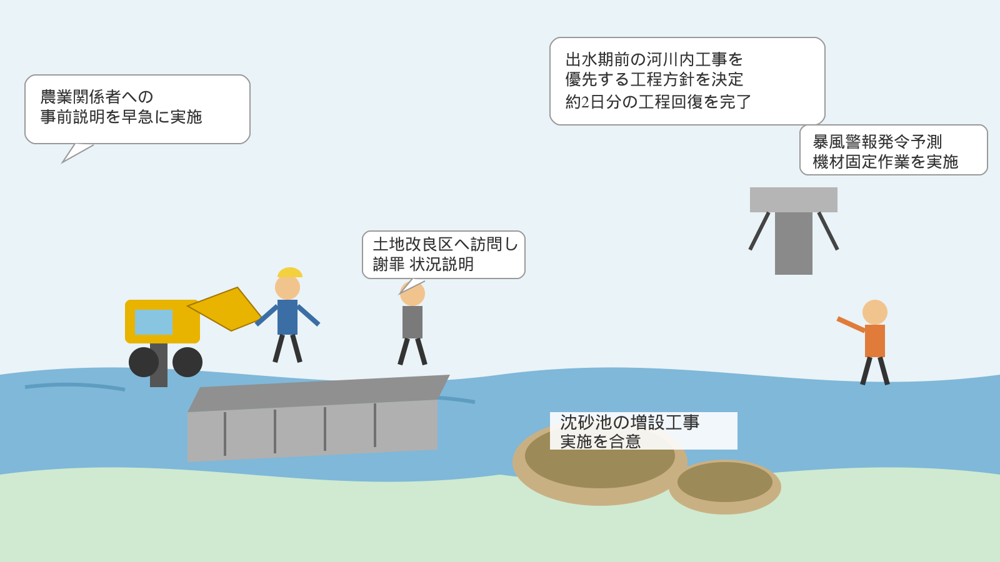
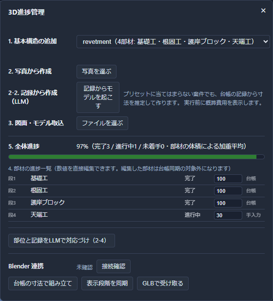

## はじめに

5日間のハッカソンで、建設・土木の現場に向けたLLMアプリ「**Project_Tree**」を作りました。

きっかけは単純な違和感でした。LLMに議事録やメールを読ませて「時系列を整理して」と頼むと、それらしい要約は返ってきます。でも数日後に見返すと、要約の中に**元の資料には書いていない数字**が混ざっていることがある。日付が1日ずれている。「たぶんこう」という推測が、断定文として紛れ込んでいる。

これが雑談の要約なら笑い話で済みます。でも対象が工事の進捗記録だったらどうでしょうか。「完了」と「完了予定」を取り違えた要約が現場に流れたら、それは事故につながりかねません。

LLMには構造的に苦手なことがいくつかあります。

- **トークンコストがかさむ**（毎回全文を読ませると高い）
- **幻覚を生む**（無いことを自信満々に書く）
- **事実と推測の境界が曖昧になる**（要約すると両方が同じ文体になる）
- **非決定的**（同じ入力でも毎回微妙に違う出力が返る）
- **答えられない質問にも答えようとする**（資料に無いことも「たぶん」で埋めてしまう）

Project_Treeは、この5つの弱点を**アプリの設計そのもので封じ込める**ことを目標にしました。この記事では、その設計と、実際に動かして見つかった落とし穴、直した過程を書きます。


## 何を作ったか

Project_Treeは、建設現場のやり取り（議事録・メール・現場写真）を読み込み、

1. 時系列を自動整理した「**業務確定台帳**」を作り
2. 段階ごとの「**資料用イメージ図**」（LLMが描く漫画絵風の図解）を生成し
3. **2D/3Dモデル**と進捗率を紐付け、
4. 会議用資料（pptx / pdf / word / excel）へワンクリックで出力する

というアプリです。ボタンひとつ（「▶ 出力」）を押すと、この一連の処理が原価を提示したうえで自動的に走ります。


*「出力」を押すと、記録が5段階のカードに整理され、同じ部材データから組み立てた3Dモデル（下段）が並んで表示される*

## 課題：LLMを信用しすぎると台帳が壊れる

開発の最初の壁は、**LLMに「原因はこれです」と言わせたときに、それが本当に記録に基づいているのかを誰が保証するのか**という問題でした。

試しにClaude Opus 5へこう聞いてみます。

> 「この工事の進捗が遅れている原因は何ですか」

もっともらしい答えが返ってきます。しかしその中の「6/2に約3日遅延と記録され」という一文が、本当に台帳の中にあるイベントを指しているのか。それとも文脈から尤もらしく作文しただけなのか。**LLMの出力を見ただけでは判別できません。**

これを解決しないまま「推論結果」として画面に出すのは、幻覚をそのまま業務に流し込むのと同じです。

## 解決策：「一度だけ生成し、以後は参照する」

Project_Treeが採用したのは、次の設計原則です。

> **LLMは1回だけ呼ぶ。その後の整合性チェック・検索・集計はすべてSQLで行う。**

具体的には、台帳を2つの「レーン」に分けます。

| レーン | 何をするか | 根拠 |
|---|---|---|
| **rule レーン** | SQLだけで検出できる事実（食い違い・記録の空白）を機械的に検出 | 常にトレース可能 |
| **llm レーン** | LLMが自由に仮説を立てる（原因究明・新発見） | 「仮説・未検証」ラベル必須 |

そして、llmレーンの出力には**必ず根拠となる `event_id` を引かせ**、その `event_id` が実在するかをコードで検証します。

```python
# projecttree/inference.py
kept, unverified = [], []
for f in data.get("findings", []):
    ids = [i for i in f.get("basis_event_ids", []) if i in valid_ids]
    bad = [i for i in f.get("basis_event_ids", []) if i not in valid_ids]
    f = dict(f, basis_event_ids=ids, dropped_ids=bad)
    # 根拠が1件でも実在すれば「事実に基づく主張」、
    # 1件も実在しなければ「仮説」へ強制的に振り分ける
    (kept if ids else unverified).append(f)
```

実際に動かすと、こういう結果になります。

```
[原因究明/high] 6/1の3日間の施工中断により当該区間が約3日遅延。
                6/15に約2日回復したが、残1日の調整完了の記録がない。
                根拠 4 件 / 捏造ID: なし
```

LLMが存在しないイベントIDを引いた場合は「捏造ID」として自動的に破棄され、その主張は根拠あり一覧から外れて「仮説」欄に落ちます。**画面上で「これは検証済み」「これは未検証」が常に区別できる**ようにしたことで、LLMの出力を安心して業務に使えるようになりました。

## 工夫したところ①：呼ぶ前に必ず原価を見せる

トークンコスト対策として、**LLMを呼ぶすべての箇所で、実行前に見積りを返し、確認するまでAPIを呼ばない**という制約を徹底しました。

```python
def infer_from_prompt(ledger, thread_id, question, *, dry_run=False):
    ...
    est = preflight("infer_proposal", INFER_SYSTEM, evidence_text, 1200)
    if not est["allowed"]:
        return {"status": "blocked", "reason": est["reason"], "estimate": est}
    if dry_run:
        return {"status": "dry_run", "estimate": est}   # ← ここでAPIはまだ呼ばれない
    ...
```

UI側は、見積りをそのまま `confirm()` ダイアログに出します。

```
段階2のイメージ図を作ります。

モデル: claude-sonnet-5
概算コスト: $0.035（約5.2円）

実行しますか。
```

さらに、機能ごとに使うモデルを自動で切り替えています（Haiku / Sonnet / Opus）。「タグ付け」のような軽い処理にOpusを使うのは無駄なので、要求される推論の深さでtierを分けました。

```python
TASK_TIER = {
    "infer_proposal": "heavy",   # 原因究明・新発見 → Opus
    "classify_stage":  "medium", # 段階分類          → Sonnet
    "extract_event":   "light",  # 構造化抽出だけ    → Haiku
}
```

Anthropic APIが利用上限に達した場合に備えて、SDK互換のプロキシ（Orca Router）へ実行時に切り替えられるようにもしました。この記事の検証も、途中からOrca Router経由（`anthropic/claude-sonnet-5` / `anthropic/claude-opus-5`）で行っています。

## 工夫したところ②：資料用画像を「編集できる絵」にする

会議資料には、文字だけの表よりも一目でわかる図があった方がいい。そこでLLMに、記録された状況を**SVGの漫画絵**として描かせる機能を作りました。

```python
SYSTEM = """建設・土木の現場の状況を、会議資料に載せる「イメージ図」として描いてください。

決まりごと:
- 意味のあるまとまり（人物・重機・構造物・注記など）は必ず
  <g class="pt-obj" id="任意のID" data-label="日本語の名前"> で包む。
  あとから利用者がこの単位で動かすので、包み忘れると編集できなくなる。
"""
```

「まとまりごとに `id` を振らせる」というのがポイントです。ラスタ画像だと生成後の修正は「作り直し」しかできませんが、SVGなら**要素単位で位置・大きさを動かせます**。生成した原本は書き換えず、編集内容は別テーブルに保存して描画時に重ねる、という設計にしたので、いつでも生成時点の状態に戻せます。

実際に作られた図（河川護岸工事の記録から自動生成）がこちらです。


*仮設沈砂池・工程遅延の注記・暴風警報まで、台帳の記録（河川護岸整備工事・段階3）から自動で描画される*

## 工夫したところ③：ワンクリックの裏で起きていた事故

「出力」ボタン1つで、資料取込→時系列作成→段階分類→3Dモデル生成→進捗算出→推論、までを一括で走らせる機能を作った際、**2つの実際の事故**に遭遇しました。

**事故1：抽出が「成功」と表示されるのに記録が1件も増えない**

原因は、LLM呼び出し用のクライアントがモジュールのimport時に生成されており、画面から後で入力したAPIキーを反映していなかったことでした。全件401エラーで落ちていたのに、エラーハンドリングの外側では「成功」扱いになっていたのです。呼び出し直前にクライアントを差し替えることで解決しました。

**事故2：フォルダ名で指定した案件と違う案件に記録が付く**

「案件への自動割り当て」を担当するモジュールは、資料の中身だけを見て似た名前の既存案件を推定します。そのため、利用者が「このフォルダの中身はこの案件」と明示していても、その指定が無視されて別案件に記録が吸い込まれることがありました。取り込み時の指定を対応表に残しておき、機械の推定より人の指定を優先するよう補正を入れて直しました。

一括処理は「便利」を目指すほど、途中の1工程が壊れていることに気づきにくくなります。**各工程が成功・失敗・スキップを個別に返し、実測原価とともにログへ出す**ようにしたことで、この2つの事故はどちらもログを見た瞬間に発覚しました。

## 技術構成

```
FastAPI + SQLite（台帳）
  ├─ extractor.py    資料 → イベント・主張（LLM 1回）
  ├─ threader.py     イベント → 案件への割り当て（LLM 1回）
  ├─ stages.py       5段階のストーリーテリング分類（ルール主軸）
  ├─ inference.py    推論・段階分類・部位対応（引用検証つき）
  ├─ illustrate.py   資料用イメージ図（SVG生成・編集）
  ├─ modelgen.py     2D/3Dモデルの組み立て・書き出し（trimesh・LLM不使用）
  ├─ modelgen_llm.py 記録から寸法をLLMに推定させてモデルを起こす
  ├─ vision.py       写真から部材を推定する
  ├─ progress.py     部材進捗・全体進捗（台帳から機械的に算出）
  ├─ masking.py      API送信前の機密情報マスキング
  └─ autorun.py      9工程の一括実行・原価見積り

three.js（3Dビューア・ローカル生成が既定）+ Blender MCP（任意接続時のみの追加連携）
```

2D/3DモデルはBlenderが無くても作れます。台帳の部材データ（形状・寸法・段階）は `modelgen.py`（trimesh + ezdxf）がローカルで組み立て、three.jsのビューアへGLBとして渡します。DXF・SVGの2D平面図も同じ経路です。LLMを使う場合も、LLMに出させるのは「寸法・形状パラメータのJSON」だけで、実際の立体化は常にローカルのコードが行うため、費用は既定で0円です。

その部材データを用意する経路は3つあります。護岸・橋梁のプリセットから足す方法（費用0円）、現場写真から推定させる方法（`vision.py`）、そして台帳の記録そのものから起こす方法（`modelgen_llm.py`）です。3つ目は、案件名がプリセットのキーワードに当たらない工事のために足しました。実際、解体工事なら「仮囲い・防音パネル→校舎躯体→がれき集積→更地」、上水道管の更新工事なら「掘削溝→基礎砕石層→ダクタイル管→埋め戻し→路面復旧」と、工種に応じた別々の構造が返ってきます。**プリセットへ黙って落とすことはしません。** LLMが使える形を返せなければ理由を返して止まります。根拠のない図が資料に混ざる方が、図が無いことよりも害が大きいからです。

そのうえで、Blenderを起動している利用者向けに、任意で使える追加連携も用意しました。BlenderのMCPアドオン（127.0.0.1:9876）に接続すると、同じ部材データをBlender側にも組み立てさせ、段階ごとの表示絞り込みやGLB書き出しを同期できます。Blenderが起動していなくても、繋がっていなくても、アプリ本体の3Dモデル作成・表示・出力はそのまま動きます。


*「基本構造の追加」「写真から作成」「記録から作成（LLM）」「図面・モデル取込」はいずれもBlender不要。Blender連携は下部に独立した任意ボタンとして分離してある（画像は未接続の状態）*

## 実際に動かしてみた数字

ハッカソン用のサンプル資料（実データを模した工事記録）で通しテストした結果です。
同梱している台帳は、紹介する4案件ぶんに絞り込んであります。

| 項目 | 実測値 |
|---|---|
| 取り込んだ資料 | 27件 |
| 抽出したイベント | 103件 |
| 抽出した主張（Claim） | 76件 |
| 案件数（工事） | 4件（護岸・橋梁・解体・上水道管） |
| 生成したイメージ図 | 19枚（$0.021〜0.113/枚） |
| 推論1回あたりの実測コスト | $0.023〜0.047（Opus 5使用時） |
| 写真・記録→3Dモデル化 | $0.0026〜0.011/回（Haiku 4.5 / Sonnet 5使用時） |
| 累計API実測コスト | 約$3.4（絞り込み前の全案件を処理した分を含む） |

絞り込み前は、資料112件・イベント431件・主張345件・案件51件を同じパイプラインで処理しています。
提出物としては、通しで見てもらえる4案件だけを残しました。

デモ自体（保存済みデータの閲覧・資料出力）はLLMを一切呼ばないため原価0円で完結します。API呼び出しが発生するのは、利用者が明示的に「見積りを確認して実行」を選んだときだけです。

## まとめ

Project_Treeで一番伝えたかったのは、「LLMを賢くする」ことではなく「**LLMの出力を信用していい範囲を、アプリ側で区切る**」ことです。

- 根拠のない主張は自動的に「仮説」へ落とす
- 原価は必ず実行前に見せ、無言で課金しない
- LLMは1回だけ呼び、あとはSQLで再現可能にする
- 生成物（イメージ図）は編集可能な形で持ち、作り直しを課金なしで許す

どれも派手な機能ではありませんが、**「業務でそのまま使えるか」を分けるのはこの地味な部分**だと思っています。実際、一括実行のテスト中に見つかった2つの事故は、どちらも「ログに実測値と工程ごとの成否を出す」という地味な作りが無ければ気づけませんでした。

似たような「LLMの出力を業務データに混ぜたいが、混ぜた瞬間に汚染が心配」というテーマに取り組んでいる方の参考になれば嬉しいです。
